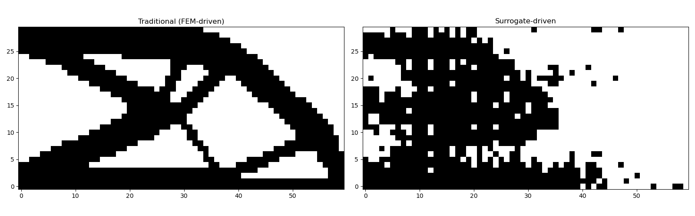

# JAX-FEM Surrogate Topology Optimization

A proof-of-concept project exploring the use of a CNN surrogate model to replace finite element method (FEM) solves in structural topology optimization. Built using [JAX-FEM](https://github.com/deepmodeling/jax-fem) for simulation and PyTorch for the surrogate model.

## Problem Setup

A 2D cantilever beam (60×30 mesh, QUAD4 elements) with a fixed left wall and a downward point load applied along the bottom edge. The goal of topology optimization is to find the optimal material distribution (density field ρ) that minimizes structural compliance (maximizes stiffness) subject to a volume fraction constraint of 50%.

## Project Structure

```
Beam Example/
├── DataSetGeneration.py     # Runs SIMP topology optimization across varied load locations
├── DataSetParser.py         # Parses VTU outputs into a training dataset
├── Train.py                 # Trains CNN surrogate on (ρ, x_load) → compliance
├── NNTopoOpt.py             # Surrogate-driven topology optimization
└── Plotting.py              # Comparison plots
```

## Pipeline

### 1. Traditional Topology Optimization (SIMP)

Topology optimization is performed using the SIMP (Solid Isotropic Material with Penalization) method via JAX-FEM's MMA optimizer. The load location is varied across all 58 integer node positions along the bottom edge (x = 1 to 58), producing 58 optimization runs of 51 iterations each.

Each run saves:
- VTU files containing the density field θ and displacement field at each iteration
- A compliance log (compliance value at each iteration)
- The load location `x_load`

### 2. Dataset Generation

Intermediate iterates from each optimization run are harvested as training samples. Each sample consists of:

- **Input:** density field ρ reshaped to `(60, 30)` + scalar `x_load`
- **Output:** scalar compliance C

This yields ~3000 samples covering the full range of density fields from the initial uniform distribution through to near-converged binary structures.

### 3. Surrogate Training

A CNN surrogate is trained to predict compliance from the density field and load location:

```
Input: ρ (1, 60, 30) + x_load (scalar)
  → Conv2d(1→16) → ReLU → MaxPool
  → Conv2d(16→32) → ReLU → MaxPool
  → Flatten → Concat(x_load)
  → Linear(3361→128) → ReLU → Linear(128→1)
Output: compliance (scalar)
```

Trained with MSE loss, Adam optimizer, normalized targets.

### 4. Surrogate-Driven Topology Optimization

The trained PyTorch surrogate is wrapped to provide both the compliance value and gradient `dC/dρ` (via `torch.autograd`) and plugged into the same MMA optimization loop in place of the FEM solver.

## Results

Comparison of the converged density fields for an end load (`x_load = 60`):



The traditional FEM-driven result (left) produces the expected X-truss structure. The surrogate-driven result (right) captures the general topology but with noisier density boundaries, reflecting the approximate nature of the surrogate gradients and the limited training dataset size.

## Dependencies

- [jax-fem](https://github.com/deepmodeling/jax-fem)
- JAX
- PyTorch
- meshio
- numpy
- matplotlib

## Limitations and Future Work

- The surrogate gradient `dC/dρ` is approximate, leading to noisier convergence compared to the analytical FEM sensitivities
- Dataset size (~3000 samples) is small relative to the 1800-dimensional input space
- Potential improvements: larger dataset, U-Net architecture to better preserve spatial structure, physics loss term (PINN formulation) to regularize predictions
